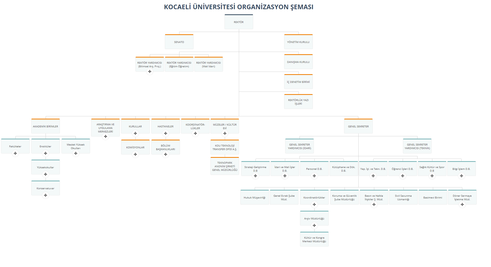
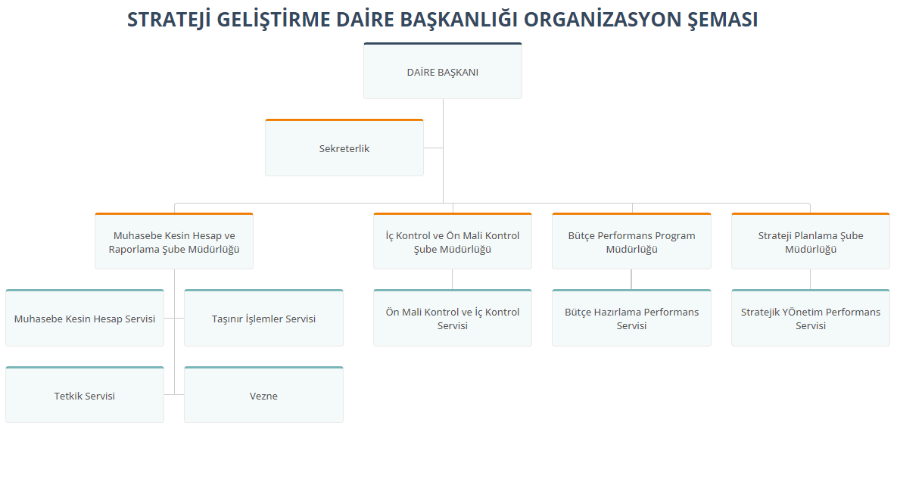
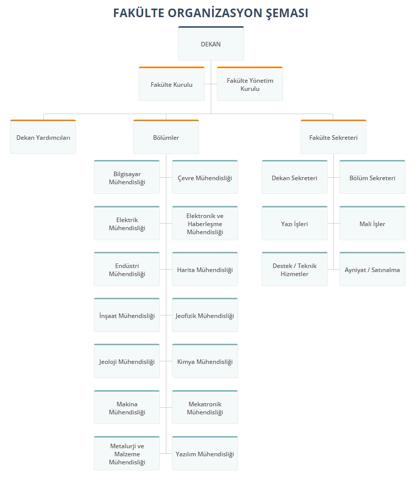
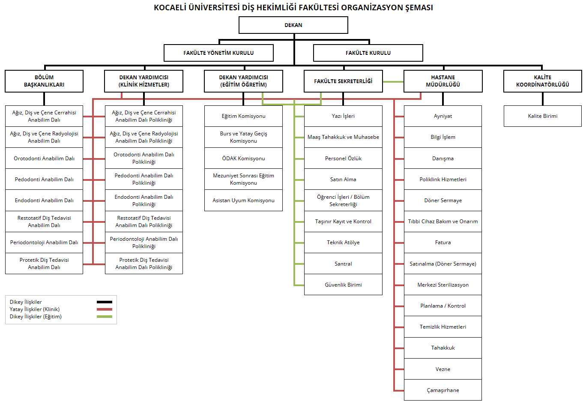

# KOCAELİ ÜNİVERSİTESİ ORGANİZASYON ŞEMALARI

## [Demo](https://kou-organization-chart.netlify.app/) ↗

## EKRAN GÖRÜNTÜLERİ

---

### [Kocaeli Üniversitesi Genel Organizasyon Şeması](https://kou-organization-chart.netlify.app/kou-organizasyon-semasi/index.html)

 

### [Strateji Geliştirme Daire Başkanlığı Organizasyon Şeması](https://kou-organization-chart.netlify.app/strateji-gelistirme-daire-baskanligi/index.html)

 

### [Sağlık, Kültür ve Spor Daire Başkanlığı Organizasyon Şeması](https://kou-organization-chart.netlify.app/saglik-kultur-ve-spor-daire-baskanligi/index.html)

 

### [Fakülte Organizasyon Şeması Genel Görünümü](https://kou-organization-chart.netlify.app/fakulteler/muhendislik-fakultesi/index.html)

 

### [MYO Organizasyon Şeması Genel Görünümü](https://kou-organization-chart.netlify.app/myo/kocaeli-meslek-yuksekokulu/index.html)

 

### [Diş Hekimliği Fakültesi Organizasyon Şeması](https://kou-organization-chart.netlify.app/dis-hekimligi-fakulte-semasi/index.html)

