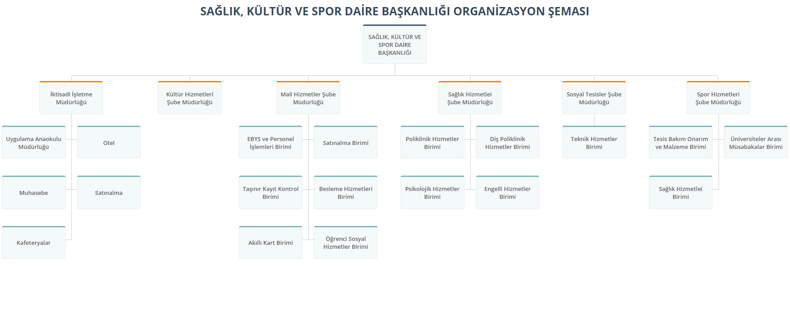

# KOU ORGANIZATION CHART

## [Live](https://kou-organization-chart.netlify.app/)🔗

 

### [Main Organization Chart](https://kou-organization-chart.netlify.app/kou-organizasyon-semasi/index.html)

 

### [Strategy Development Department Chart](https://kou-organization-chart.netlify.app/strateji-gelistirme-daire-baskanligi/index.html)

 

### [Health Culture and Sports Department Chart](https://kou-organization-chart.netlify.app/saglik-kultur-ve-spor-daire-baskanligi/index.html)

 

### [Faculty Chart](https://kou-organization-chart.netlify.app/fakulteler/muhendislik-fakultesi/index.html)

 

### [MYO Chart](https://kou-organization-chart.netlify.app/myo/kocaeli-meslek-yuksekokulu/index.html)

 

### [Faculty of Dentistry Chart](https://kou-organization-chart.netlify.app/dis-hekimligi-fakulte-semasi/index.html)

